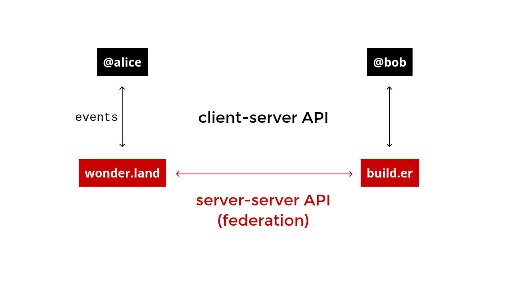
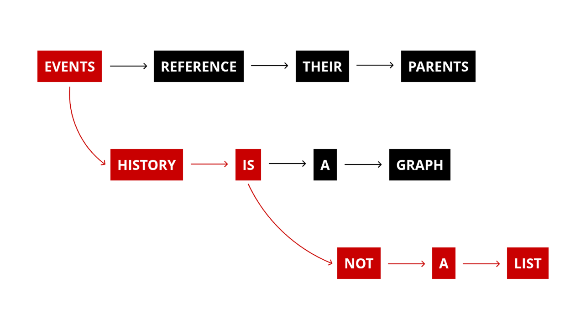

*Part one of a series. We work on Matrix. You should understand it. Pour yourself something, pull up a chair, and let's fix that.*

They say everybody lies, and yet a quiet truth hides inside every deception. For years, here is the one we've been sold about Matrix: it is hopelessly complicated, a niche experiment for the tinfoil-hat crowd, and far too thorny to explain between a Starbucks refill and the walk back to your desk.

The actual truth, however, is almost embarrassingly simple by comparison. Strip away the jargon, and Matrix is just a pile of JSON blobs, pinned into a graph, and copied across servers that agree to play nice. That is the whole magic trick; everything else is merely stage dressing.

So, light up, take a sip, and settle in. We'll unpack exactly how it works.

## The Problem Nobody Talks About

Take a look at your dock right now. You likely have Slack running the day job, WhatsApp keeping the family chat alive, and Discord humming for whatever hobby owns your evenings. Maybe you're also stuck on some clunky corporate tool nobody loves, sort of a relic of a decision someone made three reorgs ago.

Here is what none of these apps will ever admit out loud: they don't talk to each other, and that's not an accident. It's the business model.

Your messages and your social graph are intentionally locked behind someone else's proprietary API. An API that can vanish the moment it stops being profitable. You are effectively ghosted by your own chat history, Irish-goodbye style.

Except, in a brilliant plot twist, we actually solved this exact puzzle forty years ago. It's called email, and the tech industry just collectively chose to forget it.

Think about it: when a message hops from an app like Twake Mail to the outside world, we don't ask for permission. The sending server simply checks the MX record of the destination like a digital address book, opens a direct line to the designated server, and hands the letter over. There is no bouncer and no velvet rope. That open infrastructure is precisely why email outlived every single walled garden built to replace it; nobody owns the protocol, so anyone can run their own post office.

Matrix takes that time-tested architecture and gives it a much-needed glow-up for the modern era. It is federation, but engineered for instant messaging.

Though, granted, the comparison isn't entirely perfect; while email is fundamentally fire-and-forget, Matrix has to keep a live, synchronized, conversation in lockstep across an entire global network. Anyway, the heartbeat underneath remains identical: an open protocol, no boss server, and everyone talking directly.

If you want the ultimate elevator pitch, one we'll spend the rest of this piece earning, it's this: **Matrix is essentially email in Git.**

## Your Address Is Your Identity

To understand how this functions in practice, we have to start with how you are found on the network. A standard Matrix ID reads like this: `@alice:wonder.land`. It looks cute and very Lewis Carroll, but it is doing some heavy engineering work under the hood.

The part after the colon, `wonder.land`, isn't a vanity flourish, that's pure routing. So any foreign server trying to reach Alice resolves that domain like a normal hostname, locates her specific homeserver, and connects to it directly. Identity and network address are fused into one single string, requiring just one lookup with no bloated central directory standing in the way.

From a sociological perspective, this yields a deeper truth: Matrix identities aren't just rows in somebody's centralized spreadsheet. You can think of `@alice:wonder.land` and `@bob:build.er` as completely separate citizens of entirely different countries, who simply happen to speak the same diplomatic language.

As you explore this ecosystem, there are two specific namespaces worth tattooing on your forearm:

* **`@user:server`**: This represents an individual user.
* **`!opaque_id:server`**: This represents a room. It uses an ugly, unreadable string for reasons we'll cover in a moment, so usually it also wears a friendlier public alias like `#name:server`.

## The Homeserver: Your Post Office, Your Vault

Behind every one of those addresses hums an engine called the homeserver. This software implements the core [Matrix client-server API spec](https://spec.matrix.org/latest/client-server-api/) and diligently juggles three primary jobs: acting as your account keeper, serving as your client's waiter, and operating as an embassy to every other servers out there.



Because of this setup, your client app of choice (*being [TwakeChat](https://twake.app/), [FluffyChat](https://fluffychat.im/m), [Cinny](https://cinny.in/), or else*) talks to exactly one homeserver. You log in once, grab a session token, and every single move you make routes through that single machine. Your client never has to know a foreign server even exists; that is the homeserver's problem, by design.

Naturally, these server implementations come in a few different flavors depending on your performance preferences:

* **[Synapse](https://github.com/element-hq/synapse)**: Python-built, incredibly full-featured, and historically prone to drinking all your RAM doing it. It remains the undisputed Cadillac of homeservers.
* **[Dendrite](https://github.com/element-hq/dendrite)**: A leaner, Go-based alternative that is closing the feature gap fast.
* **[Conduit](https://conduit.rs/)** (and its forks): Written in Rust, stripped down to the absolute essentials, and perfectly happy to idle quietly on a Raspberry Pi.

Ultimately, wherever you choose to park your homeserver determines exactly who is holding your data. If you use matrix.org, the Foundation has it. If you use a corporate instance, the company has it. But if you choose to self-host, then congratulations; the data is truly yours!

The protocol happily shrugs either way, even if your corporate compliance officers might not.

## The Illusion of the Room

This brings us to the core architectural breakthrough where Matrix officially stops being "just another chat service."

In the Matrix universe, a chat room doesn't actually live on a specific server. Instead, it gets replicated everywhere it is invited. Every homeserver having a represented user in that room keeps a complete, locally authoritative copy of the entire room's state.

Because there is no master copy, there is no single point of failure. If your homeserver goes down mid-sentence, the conversation keeps moving forward elsewhere on the network without missing a single beat. When your server comes back online, it quietly syncs the delta and catches up. Much like checking your phone after a long flight.

To visualize this, let's return to our original analogy of Git: a Matrix room is effectively a software project that every participating server has fully cloned. You push an entry to your local copy, and the protocol automatically works behind the scenes to keep everyone else's reality in sync.

This continuous synchronization happens over the [Matrix server-server API](https://spec.matrix.org/latest/server-server-api/), more commonly known as the Federation API. When a homeserver receives a new event, it verifies its legitimacy, files it locally, and fans it out over authenticated HTTPS.

Every receiving server double-checks the homework before passing it along, and this check is pure cryptography, no phone call to the client, no "hey, did you really send this?" ping back to Alice. Each homeserver signs its outgoing events with its own `ed25519` server key. The receiving server fetches that key via `/_matrix/key/v2/server`, verifies the signature against the event, and moves on. This proves the event genuinely came from that homeserver; it does not prove a specific human typed it. That second, stronger guarantee is a separate job, handled by the E2EE layer further down.

## Everything Is An Event

To make this decentralized replication possible, history in Matrix cannot be treated as a static database table. Instead, it is treated as a living stream of structured events. Every single thing that happens in a room shows up wrapped in the exact same JSON envelope:

```json
{
  "type": "m.room.message",
  "event_id": "$26RqwJMLw-yds1GAH_QxjHRC1Da9oasK0e5VLnck_45",
  "sender": "@alice:wonder.land",
  "room_id": "!xyz:build.er",
  "origin_server_ts": 1632489532305,
  "content": {
    "msgtype": "m.text",
    "body": "WE ARE LATE!!!"
  }
}

```

Whether it is a standard text message, someone joining the room, or a room topic being changed at 2:00 AM for no apparent reason, it all arrives in the same envelope. Only the `type` field shifts. The server simply checks the envelope's postage; and what happens inside the `content` block is strictly between the sender and your client app.

To keep this stream organized, events are broadly divided into two main camps:

1. **State events**: These carry a unique `state_key` and define the current facts of the room (e.g., what the room is named, or who holds administrative power). They overwrite their predecessors on sight.
2. **Timeline events**: These represent the permanent, linear history of the room (e.g., messages, reactions, images, or calls signaling). They are appended forever. Even when you edit a message, Matrix doesn't rewrite history; it issues a brand-new timeline event pointing back at the original via an `m.relates_to` property.

## History as a Directed Acyclic Graph (DAG)

Because events are happening concurrently across different servers, room history cannot be stored as a tidy, sequential list. Instead, it is structured as a Directed Acyclic Graph, or DAG.



Why choose this level of structural complexity? Consider the environment: you have independent servers scattered globally writing to the database at the exact same millisecond with no central referee. A plain list requires a centralized scorekeeper to decide who went first. Because Matrix has none, a DAG allows each individual server to append events to whatever reality it is currently looking at.

Inevitably, the graph will fork. However, those branches smoothly braid back together the moment the servers connect and compare notes. The end result is a system that achieves global consistency with zero real-time coordination required.

Git runs on this exact same structural insight, using commits that point back to parent commits without relying on a central clock. Matrix's ultimate party trick is resolving these inevitable DAG forks automatically through a deterministic process called **state resolution**. By relying on strict mathematical rules weighted by user power levels, it produces one canonical answer that every server on the network reaches entirely independently.

## The Network Waltz

If we were to zoom in closer on the mechanics, the actual step-by-step sequence of Alice sending a message looks like a finely choreographed dance across four distinct stages:

**1. Client → Homeserver (Client-Server API)**

Alice types her message and hits send. Her client fires a `PUT` request to `/_matrix/client/v3/rooms/{roomId}/send/{eventType}/{txnId}`. Her local homeserver validates the request, constructs the formal JSON event envelope, signs it, and assigns it a unique `event_id`.

**2. Homeserver → DAG**

The newly minted event is immediately appended to the room's local DAG on Alice's server, explicitly referencing the current `prev_events`. If any complex state modifications are involved in this step, the state resolution algorithm runs locally to ensure validity.

**3. Homeserver → Federation (Server-Server API)**

Now, Alice's homeserver broadcasts the event to all other homeservers with users in that room using a `PUT /_matrix/federation/v1/send/{txnId}` request. Each receiving server independently validates the cryptographic signature, verifies the authentication chain, and appends the event to its own local clone of the DAG.

**4. Homeserver → Clients**

Finally, listening clients poll their respective servers via `/_matrix/client/v3/sync` using a cursor token. The homeserver returns everything that has changed since their last check-in (including timeline events, state deltas, presence updates, and typing indicators).

Clients process this data, update the UI, and immediately poll again. Matrix utilizes a **long-poll timeout** here, meaning the homeserver intentionally holds the HTTP connection open until a new event actually arrives. If a client happens to be backgrounded, a specialized push gateway takes over: the homeserver pokes it with a minimal notification payload, waking the device up so the client can fetch the full event upon resume.

> **Note**: The `txnId` used across both sending APIs acts as an idempotency key. This allows clients and servers to safely retry failed network requests without accidentally double-posting the same message twice—a small detail that yields massive correctness guarantees.

## Orchestrating Governance

Of course, letting everyone write to a shared graph simultaneously would quickly devolve into chaos without strict guardrails. To solve this, every Matrix room implements a built-in power level system that is significantly more flexible than traditional role-based management.

Instead of dealing with rigid arbitrary groups, permissions are governed by a single `m.room.power_levels` state event containing a simple dictionary of integer thresholds:

```json
{
  "users": {
    "@alice:wonder.land": 100,
    "@bob:wonder.land": 50
  },
  "users_default": 0,
  "events": {
    "m.room.name": 50,
    "m.room.power_levels": 100
  },
  "ban": 50,
  "kick": 50,
  "redact": 50,
  "invite": 0
}
```

Under this model, users are assigned a flat numerical level. Concurrently, specific actions and event types require a minimum numerical threshold to execute. If you want to act, you simply need to meet or exceed the number required. Furthermore, you cannot grant another user a power level higher than your own. It is a single state event evaluated at every turn, no separate permissions APIs or convoluted matrices required.

The sheer architectural flexibility this creates is remarkable: broadcast channels, heavily moderated communities, automated bot-controlled rooms, and open team spaces are all constructed using the exact same underlying logic, just with different numbers configured in the event blob.

For macroscopic control, governance extends to Server ACLs (Access Control Lists), which allow a room to entirely blacklist bad-faith servers. And when the underlying mathematics of the protocol need a patch, communities can seamlessly migrate to new room versions, implementing updated structural rules while keeping the historical conversation intact.

## The Cryptographic Choreography

If decentralized governance sounds complex, the privacy layer takes it a step further. End-to-end encryption in Matrix isn't just a basic binary switch you flip on; it is a sophisticated, multi-course cryptographic meal:

* **Device identity keys**: The main "ID card" for your device while you are logged in.
* **Key backup keys**: Your personal safety net. A password-protected backup to restore your chat history if you lose your phone or computer.
* **One-time pre-keys**: Single-use keys used to start a new chat.
* **Olm session keys**: Keys for 1-on-1 chats. They change with every single message sent to keep the conversation completely private.
* **Megolm session keys**: Keys for group chats. They change whenever someone joins or leaves the room so only current members can read the messages.

Because of this intricate choreography, when a message occasionally fails to decrypt in your client, it rarely means the entire protocol has broken down. More often than not, it simply means one of these highly transient keys was temporarily lost in transit or rotated a fraction of a second too early.

Anchoring this entire web of trust is **cross-signing device verification**. Once you verify a contact's master key (usually via an in-person QR code scan or emoji comparison), that explicit trust automatically cascades down to every subsequent device they verify themselves, ensuring security that scales with user behavior.

## The Brutal Reality

When you strip away the marketing and the techno-babble, the reality of Matrix is beautifully stark: it is JSON blobs, pinned to a graph, copied across servers that answer to no single overlord.

Every other component, from the application bridges and end-to-end encryption to the state resolution algorithms doing their quiet math in the background, exists purely to let that simple graph structure run securely and at scale. Third-party clients paint the visual interface, identity servers translate legacy identifiers like emails into Matrix IDs when you want to be discovered, and application services bridge the entire graph outward to Slack, Discord, and whatever else refuses to federate natively.

If you ever need to remember it simply, just fall back on our trusted shorthand: **it's email in Git.**

The federation aspect is the email half; independent servers chatting freely without an overarching gatekeeper. The DAG aspect is the Git half; an append-only, cryptographic history that nobody can quietly rewrite behind your back. It is a lean, structurally accurate mental model, and you have now officially earned the right to use it at parties.

The persistent lie was that Matrix is too complicated to understand.
The truth, like most good engineering truths, turned out to be far more elegant than the rumor.

That was the whole protocol stripped down to the studs.
Many rabbit-holes are left to cover, and we shall come back shortly with more abouts.

---

We hope your coffee has not gone cold, and your croissant is yet to be finished, so you can enjoy the end of them, and have a background thought of this post content.
